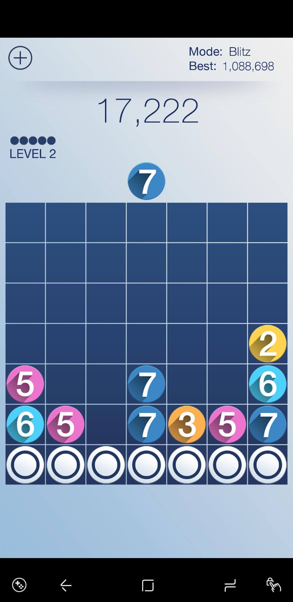

# Drop7 Reinforcement Learning Challenge

## The Game

Drop7 is a smartphone strategy game produced by Zynga. The goal of the game is to keep the balls from getting to the top of the 7x7 grid. Balls pop if the ball is connected either vertically or horizontally to the number on the ball. New rows of gray balls appear over time that must have balls pop near them before they reveal their number. A more thorough explanation of the game can be found [here]( https://www.youtube.com/watch?v=L_RLjEruSx8) (Note: this game shows several game modes, this challenge focuses only on "blitz mode").

  
**Note:** While this repository attempts to implement the rules of Drop7, I am not the owner of the game or copyright holder. This code should be used strictly for research and not commerical purposes. In addition, no guarantees are made between the similarity of my implementation and the actual rules. For example, I do not know the rules governing game initialization, nor do I know the chain bonus multiplier for very large chains, so both of these are only approximate. 

## The Challenge
Create a neural network that can play the game and achieve a long-running average of 353,000 or more. 

**Motivation.** This game has been my family's biggest time-waster for several years now. It is challenging and addicting, and well-suited for deep learning applications. It contains a small set of discrete possible choices to be selected from each turn, but many different patterns make for a variety of strategies during different stages of the game. For the last several years I've maintained an average score of around 350,000 over several thousand games. 353,000 will be the target of the challenge because if an algorithm achieved that score I would be confident that it was outplaying me and any human player that I know (if you have a higher average score, please let me know!).

## Repository Details
The repository is made to imitate the OpenAI [gym](http://gym.openai.com/), which provides a simple interface to connect agents (neural networks designed to play the games) with the games. The file drop7.py implements the game logic. Drop7Gym.py implements the interface that allows you to programatically interact with the game. Demo.py introduces the basic ways of interacting with the game. You are encouraged to read the documentation for OpenAI's gym and play around there to better understand what each function does and what it returns. 

